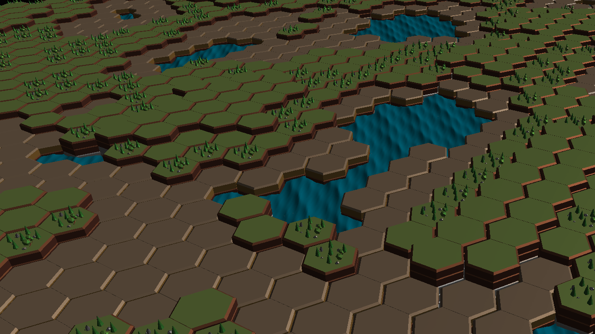
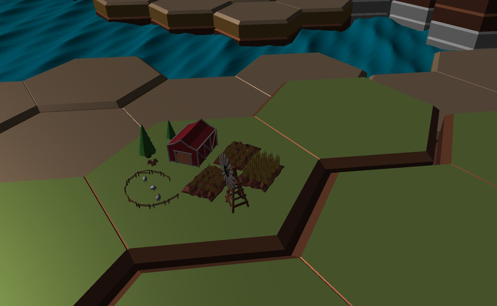
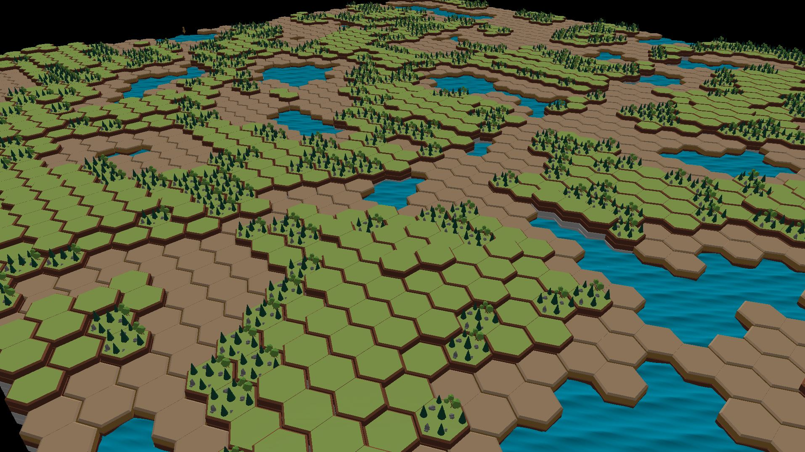

# City Building Game [WIP]



### About
I like city building games so i'm making one for myself. I'm working on it in my free time, so it's not very complete just yet.



### Controls
```
Mouse1 - Rotate Camera
Shift + Mouse - Pan Camera
ESC - exit
```
### Libraries Used
- GLEW - http://glew.sourceforge.net
- GLFW - https://www.glfw.org
- GLM  - https://glm.g-truc.net
- STB_IMAGE - https://github.com/nothings/stb

### Requirements
- Graphics card that supports OpenGL 4.1



### Credits
- Programmer : Me
- Art Director / 3D Artist : My younger brother, sherif